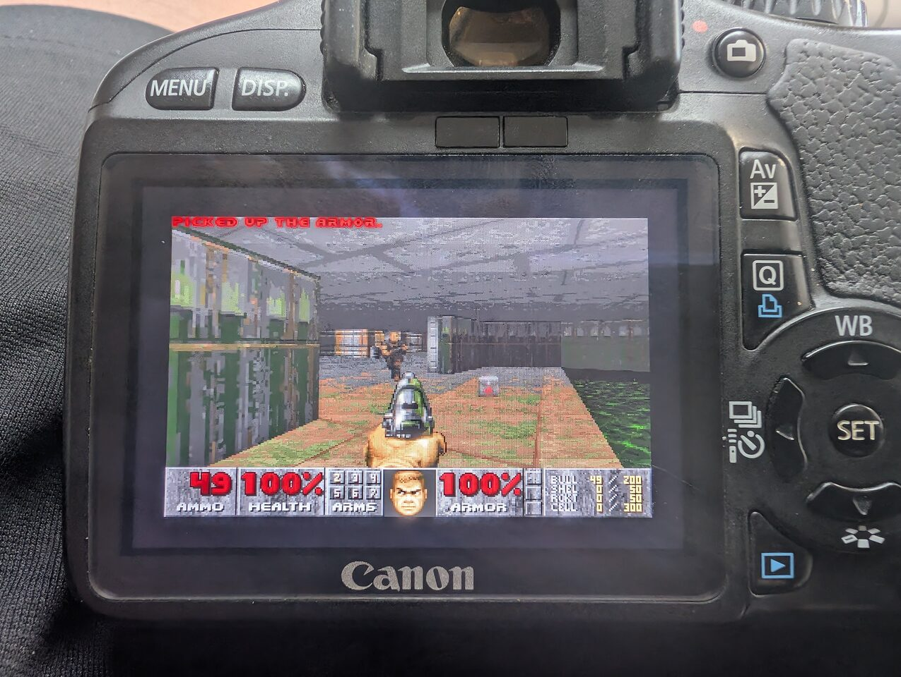

# Doom 550D

Doom running as a Magic Lantern module on the Canon EOS 550D / Rebel T2i / Kiss X4.

This repository contains the module source and release documentation. It does
not contain Doom, Freedoom, or any other WAD data.

> Status: experimental. Release `v0.3.1` is built for the Canon EOS
> 550D and is the best playable build tested so far. It is not intended for
> other cameras.

## Watch Doom550D in action

[](https://www.youtube.com/watch?v=G8sIcxkxpmQ)

[▶ Watch Kick play DOOM on a Canon EOS 550D](https://www.youtube.com/watch?v=G8sIcxkxpmQ)

[⬇ Download the latest Doom550D release](https://github.com/lauris-nl/doom550d/releases/latest)

## Screenshots





## Features

- selectable Doom-family IWADs from the Magic Lantern Games menu;
- persistent debug logging control and safe Doom-log cleanup from that menu;
- up to 32 alphabetically sorted IWAD files in `ML/DOOM/`;
- separate save slots for every exact WAD filename;
- persistent Doom menu, sound, and music settings;
- low-CPU MUS music with 24 voices, instrument families, envelopes and percussion;
- music mixed with Doom's 8-bit effects into 48 kHz mono camera audio;
- cleanup of input, display, palette, and audio state when Doom exits;
- Canon 550D press/release controls, including held run and strafe modifiers.

## Supported release target

- Canon EOS 550D / Rebel T2i / Kiss X4
- Canon firmware 1.0.9
- Magic Lantern 550D.109 core and `550D_109.sym` built from the matching
  `magiclantern_simplified` tree
- released module filename: `doom.mo`

The release binary was built from Magic Lantern base commit
`8f8fb3e2f97f156a30da62feeadbfc62244b33bc`. Keep `autoexec.bin`,
`550D_109.sym`, and `doom.mo` from compatible builds together. A module built
against different exported symbols may fail to load.

No Doom-specific Magic Lantern core modification is required for audio. The
required Canon audio stubs are already present in the base commit above. The
installed `550D_109.sym` must export these symbols:

```text
PowerAudioOutput
SetAudioVolumeOut
SetNextASIFDACBuffer
SetSamplingRate
StartASIFDMADAC
StopASIFDMADAC
audio_configure
beep_playing
```

If an older Magic Lantern installation does not export all eight names, build
and install a matching `autoexec.bin` and `550D_109.sym` before loading the
module. Building that ML base with GCC 16 additionally requires the known
`src/tskmon.c` compiler-version guard adjustment; it does not change Doom or
the runtime audio implementation.

Do not install this binary on another camera model or firmware version.

## Installation

1. Back up the SD card and verify that Magic Lantern works normally.
2. Verify that `autoexec.bin` and `550D_109.sym` come from a compatible Magic
   Lantern 550D.109 build.
3. Copy the released module to:

   ```text
   ML/MODULES/doom.mo
   ```

4. Create `ML/DOOM/` or let the module create it.
5. Copy one or more legally obtained Doom-compatible IWAD files into
   `ML/DOOM/`.
6. In the Magic Lantern Games menu, select **Doom > WAD**.
7. Keep **Doom > Debug logging** set to **OFF** for normal play. Enable it
   before reproducing a problem.
8. Restart the camera after changing the selected WAD, then start Doom.

The module creates and manages `ML/DOOM/SAVES` and `ML/DOOM/CONFIG`. If no
usable IWAD is found, the camera displays a clear message instead of starting
the engine.

> WAD files are copyrighted game data. They are not included in this
> repository or its releases.

## WAD compatibility

The selector accepts regular `.wad` files whose first four bytes are `IWAD`.
PWAD level and mod files are not offered as standalone games.

Expected Doom-family IWAD names include:

| Filename | Game |
| --- | --- |
| `doom1.wad` | Doom Shareware |
| `doom.wad` | Doom / The Ultimate Doom |
| `doom2.wad` | Doom II |
| `tnt.wad` | Final Doom: TNT Evilution |
| `plutonia.wad` | Final Doom: Plutonia Experiment |
| `freedoom1.wad` | Freedoom: Phase 1 |
| `freedoom2.wad` | Freedoom: Phase 2 |
| `freedm.wad` | FreeDM; primarily useful for multiplayer |
| `hacx.wad` | Hacx 1.2; planned, not currently playable |

The current selector checks the WAD header, not the complete game format.
Heretic, Hexen, Strife, Doom 64, PK3 files, and source-port-specific IWADs are
not supported even if a file happens to use an `IWAD` header.

Hacx 1.2 is recognized by filename, but the current module does not include
the DEHACKED parser required for its embedded compatibility patch. It exits at
the title loop when `D_DM2TTL` cannot be remapped to `D_HAXTTL`. Keep
`hacx.wad` out of the active collection until full DEHACKED support is added.

Download links for freely distributable or commercially available data:

- Freedoom: <https://freedoom.github.io/download.html>
- Doom + Doom II on Steam: <https://store.steampowered.com/app/2280/DOOM_1993/>
- Doom + Doom II on GOG: <https://www.gog.com/en/game/doom_doom_ii>
- Doom Shareware archive: <https://www.doomworld.com/idgames/idstuff/doom/doom19s>

## Controls

| Camera control | Doom action |
| --- | --- |
| Arrow keys | Move forward/back and turn |
| Hold zoom in (`+`) | Run |
| Hold zoom out (`-`) + left/right | Strafe left/right |
| SET | Fire; confirm in menus |
| PLAY | Use/open doors and switches |
| Rear wheel | Previous/next owned weapon |
| DISP. (called INFO internally by Magic Lantern) | Automap; back while in menus |
| MENU | Open/close the Doom menu |
| Delete/Trash | Escape/back; the Magic Lantern menu is blocked while Doom runs |
| Q | Confirm the Doom quit dialog |

ISO, the depth-of-field button and the shutter buttons are deliberately not
used as Doom actions. Canon handles them below the module input layer and can
otherwise show EOS overlays, autofocus, or steal the game controls.

## Saves and settings

Savegames are separated by a hash of the exact selected WAD filename:

```text
ML/DOOM/SAVES/<iwad-hash>.D<slot>
```

Selecting a save slot with SET writes it directly; existing descriptions are
retained and empty slots receive a map description. Input state is reset after
a successful save so the controls do not remain stuck.

Doom menu settings, music volume, and sound-effect volume are stored in:

```text
ML/DOOM/CONFIG/
```

The selected WAD is stored in the Magic Lantern module configuration.

## Debug logging

The Magic Lantern **Games > Doom** submenu contains two diagnostic controls:

- **Debug logging** is persistent and defaults to **OFF**. When enabled, the
  module writes engine, input and audio diagnostics to `ML/LOGS/DOOM550D.LOG`
  and `ML/LOGS/DOOMRAW.LOG`.
- **Clear Doom logs** removes only files matching `ML/LOGS/DOOM*.LOG`. It
  refuses to run while Doom is active and never removes WADs, savegames or
  configuration files.

Disabling logging does not automatically remove existing logs; use the clear
action when they are no longer needed.

## Audio

The module reads MUS lumps directly from the selected IWAD. A low-CPU integer
synthesizer renders 24 band-limited voices at 24 kHz and linearly interpolates
them into the 48 kHz Canon output, where they are mixed with Doom's original
8-bit sound effects. General MIDI program families select table-driven square,
pulse, triangle or saw characters; percussion also uses noise. Attack, decay,
sustain, release, channel volume and pitch bend are supported.

This gives an AdLib-like retro character while remaining light enough for
fluid gameplay on the 550D. It is not cycle-accurate OPL2 emulation. Music and
sound-effect levels are controlled independently from Doom's sound menu.
When debug logging is enabled, audio timing and missed buffer deadlines are
written to `ML/LOGS/DOOM550D.LOG` when Doom exits.

## Porting to another Magic Lantern camera

The released `doom.mo` is not a portable binary. Never load the 550D module on
another camera or firmware version. A port must be compiled against the exact
Magic Lantern platform and firmware symbols for the target camera. Magic
Lantern support alone does not guarantee that the display, buttons or Canon
audio hardware use the same interface.

Most of the Doom engine, WAD handling, savegame code and music synthesizer can
be reused unchanged. The camera-facing layer needs to be checked and usually
adapted in these areas:

1. **Magic Lantern build:** build and boot the matching Magic Lantern core for
   the exact camera and firmware. First verify that a minimal module loads.
2. **Display and palette:** replace the 550D assumptions in `doom550d.c` about
   the 720x480 bitmap, `BMPPITCH`, 8-bit VRAM, `LCD_Palette` and palette writes
   through `EngDrvOut`. Confirm drawing, palette restoration and repeated game
   starts before enabling audio.
3. **Buttons:** determine the target camera's raw press and release event codes
   and replace the `DOOM_BGMT_*` values. Test held directions, simultaneous
   keys, menu navigation and release events. Do not assume the 550D button
   numbers or even the same set of physical buttons.
4. **Audio:** check `build/doom.dep` against the target platform's `.sym` file.
   The current backend expects `StartASIFDMADAC`, `SetNextASIFDACBuffer`,
   `StopASIFDMADAC`, `SetSamplingRate`, `PowerAudioOutput`,
   `SetAudioVolumeOut`, `audio_configure` and `beep_playing`. A camera with a
   different audio path needs a new backend, not just renamed symbols.
5. **Storage and cleanup:** verify Canon FIO reads and writes, directory
   creation, saves, configuration, error paths, display restoration, audio
   shutdown and module unload on the physical camera.
6. **Regression testing:** test several IWADs, new and overwritten saves,
   loading, every control, repeated starts, normal quit, forced module exit and
   at least one long play session after enabling debug logging and checking
   `ML/LOGS/DOOM550D.LOG`.

Keep the target camera's `autoexec.bin`, platform `.sym` file and newly built
`doom.mo` together as one matching set. A useful contribution should identify
the camera model, firmware version, Magic Lantern commit, toolchain version,
module dependency result and every tested control. Physical access to the
camera is required; emulator-only testing is not enough for input, palette,
audio timing or cleanup.

### Expected effort

These are estimates for one developer already comfortable with C, embedded
debugging and Magic Lantern. They are engineering time, not guarantees; remote
testing and unavailable camera logs can increase the calendar time greatly.

| Target situation | Engineering work | Likely elapsed time |
| --- | ---: | ---: |
| Closely related camera with matching bitmap and audio interfaces | 3-7 working days | 1-2 weeks |
| Different button map or display/palette behavior, but usable audio exports | 1-3 weeks | 2-6 weeks |
| Different or undocumented audio hardware, missing exports, or another DIGIC generation | 4-8+ weeks | 1-3+ months |

A first build that merely loads may take only a day. A release-quality port
takes longer because the difficult work is safe shutdown, held-button input,
save/load reliability, audio deadline testing and repeated physical-camera
regression tests. A second person who owns the target camera and can return
logs quickly can shorten the elapsed time substantially.

## Building `doom.mo`

Use the Magic Lantern source tree:
<https://github.com/reticulatedpines/magiclantern_simplified>

Requirements:

- Git
- GNU Make
- Python 3
- `arm-none-eabi-gcc`
- ARM newlib headers and libraries

Place the `module/` directory from this repository at
`modules/doom550d/` in the Magic Lantern tree, then run:

```sh
make -C modules/doom550d -j4
```

Output:

```text
modules/doom550d/build/doom.mo
```

Every explicit module build also creates a source archive under
`modules/doom550d/source-backups/`. Build products and source backups are
ignored by Git.

## Known limitations

- only Canon EOS 550D firmware 1.0.9 is supported;
- changing the WAD after Doom has run requires a camera restart;
- at most 32 IWADs are listed;
- incompatible non-Doom IWADs are not yet rejected reliably;
- PWAD/mod selection is not implemented;
- the synthesizer is AdLib-like, not cycle-accurate OPL2;
- multiplayer/network play is not supported;
- when enabled, logs retain only the most recent run;
- this remains experimental software: keep SD-card backups.

## Credits and license

- Doom engine source by id Software
- Doomgeneric
- Chocolate Doom
- Magic Lantern
- Freedoom contributors
- Bas Lichtjaar <doom@lauris.nl> and contributors to this port

This project is released under GPL-2.0. Third-party game assets are not
included.
